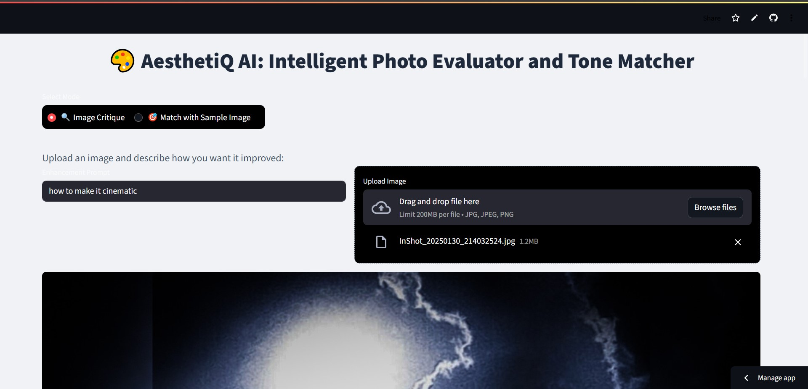
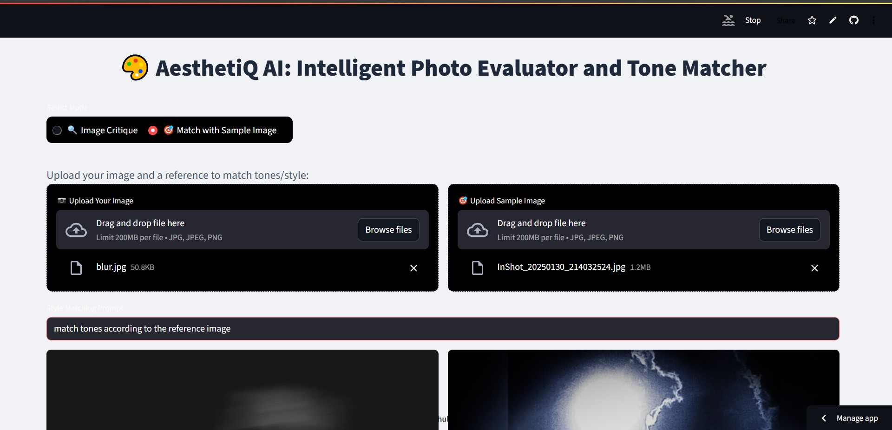
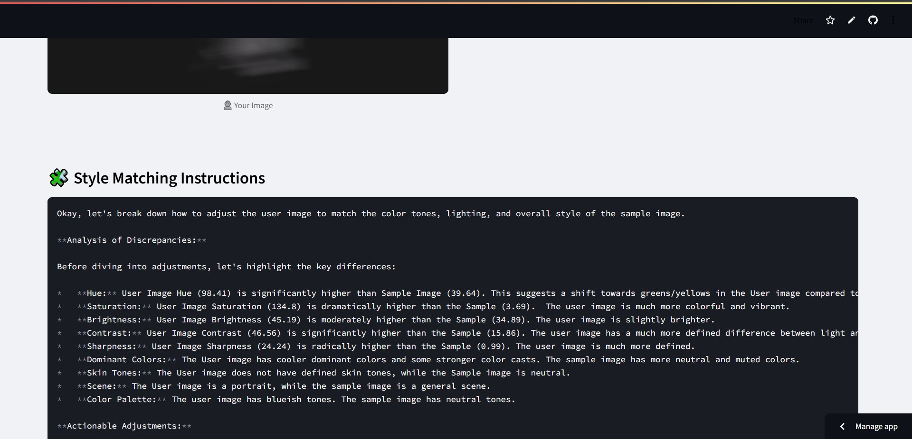

# AesthetiQ-AI 🎨✨

**AesthetiQ-AI** is an intelligent image critique and tone-matching tool, built as a **Streamlit app**, designed for creators, photographers, and designers who want aesthetic guidance and editing suggestions.

## 🚀 Features

- 📸 **Image Critique**: Upload an image and receive feedback on composition, lighting, color tones, and overall aesthetics.
- 🧠 **Prompt-Based Editing Suggestions**: Provide a prompt (e.g., “make this look cinematic” or “vintage 90s vibe”), and AesthetiQ-AI will generate personalized editing suggestions.
- 🧪 **Tone Matching from Sample Image**: Upload your original image and a **reference/sample image** — AesthetiQ-AI analyzes both and suggests how to make your original image match the tone of the reference.

---

## 📸 Screenshots

| Photo Evaluation section | Tone Matcher Section | Results |
|---------------|----------------|------------------|
|  |  |  |

---

## 🛠️ Tech Stack

- `Python`
- `Streamlit`
- `OpenCV` / `PIL` for image processing
- `CLIP` / AI model for understanding user prompts
- Optional: `color transfer` and `histogram matching` for tone adjustment

## 🌐 Use Cases

- Instagram influencers matching tones across feeds
- Photographers creating consistent visual style
- Creators improving visuals based on AI feedback

## 🔗 How to Use

1. Go to the Streamlit web app.
2. Upload your image.
3. Optionally, upload a **reference/sample image**.
4. Provide a text prompt for desired transformation.
5. Get critique + editing steps + tone matching suggestions.

---

> Designed for creators who care about **aesthetic consistency** and **creative control**, powered by AI.